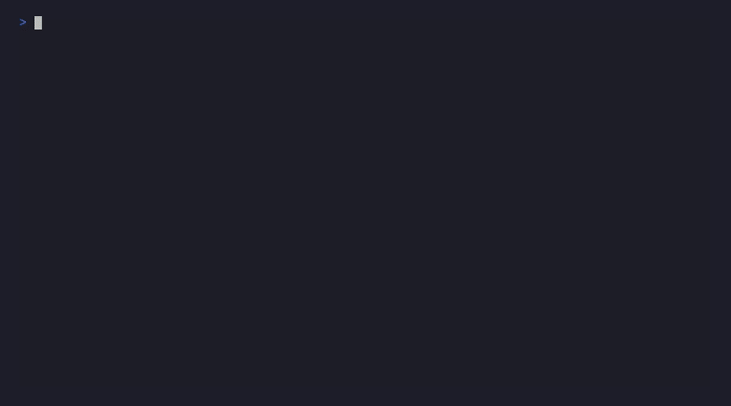

# SDK Chat

**Generate production-ready SDK samples in seconds using AI.**



```bash
./scripts/sdk-chat.sh package samples generate /path/to/sdk
```

## Installation

SDK Chat runs in Docker to ensure consistent behavior across all platforms with all language extractors pre-configured.

### Prerequisites

- [Docker](https://docs.docker.com/get-docker/) (required)
- One of the following for AI authentication:
  - GitHub token (`GH_TOKEN` or `GITHUB_TOKEN`) for GitHub Copilot
  - OpenAI API key (`OPENAI_API_KEY`) with `--use-openai` flag

### Setup

```bash
# Clone the repository
git clone https://github.com/deyaaeldeen/sdk-chat
cd sdk-chat

# Build the Docker image (one time)
docker build -f Dockerfile.release -t sdk-chat:latest .

# Make wrapper script executable (Linux/macOS)
chmod +x scripts/sdk-chat.sh
```

The wrapper scripts (`scripts/sdk-chat.sh` for Linux/macOS, `scripts/sdk-chat.ps1` for Windows) handle volume mounts and environment variables automatically.

## Quick Start

**Linux/macOS:**
```bash
# Set your authentication
export GH_TOKEN="ghp_..."

# Generate 5 samples (default)
./scripts/sdk-chat.sh package samples generate /path/to/openai-dotnet

# Use OpenAI instead of GitHub Copilot
export OPENAI_API_KEY="sk-..."
./scripts/sdk-chat.sh package samples generate /path/to/sdk --use-openai

# Custom count + prompt
./scripts/sdk-chat.sh package samples generate /path/to/sdk --count 10 --prompt "streaming examples"

# Preview without writing
./scripts/sdk-chat.sh package samples generate /path/to/sdk --dry-run
```

**Windows PowerShell:**
```powershell
# Set your authentication
$env:GH_TOKEN = "ghp_..."

# Generate samples
.\scripts\sdk-chat.ps1 package samples generate C:\path\to\sdk
```

## Supported Languages

All language extractors are included in the Docker image with no additional setup required.

| Language | Detection | Extractor |
|----------|-----------|-----------|
| .NET/C# | `.csproj`, `.sln` | Roslyn |
| Python | `pyproject.toml`, `setup.py` | ast |
| TypeScript | `package.json` + `.ts` | ts-morph |
| JavaScript | `package.json` | ts-morph |
| Java | `pom.xml`, `build.gradle` | JavaParser |
| Go | `go.mod` | go/parser |

---

## Commands

Commands follow an entity-based structure: `package <entity> <action>`.

### `package source detect`

Auto-detect the source folder (src/, lib/) and programming language (.NET, Python, Java, TypeScript, Go).

```bash
./scripts/sdk-chat.sh package source detect <path> [options]
```

| Option | Default | Description |
|--------|---------|-------------|
| `--language <lang>` | Auto | Override detection: `dotnet`, `python`, `java`, `typescript`, `javascript`, `go` |
| `--json` | `false` | Output as JSON for scripting |

**Example output:**
```
SDK: openai-dotnet
Language: dotnet
Source: /path/to/openai-dotnet/src
Extension: .cs
```

### `package samples detect`

Find existing samples folder (samples/, examples/, demo/).

```bash
./scripts/sdk-chat.sh package samples detect <path> [options]
```

| Option | Default | Description |
|--------|---------|-------------|
| `--json` | `false` | Output as JSON for scripting |

### `package samples generate`

Generate production-ready code samples using AI. Requires authentication (`GH_TOKEN` or `OPENAI_API_KEY`).

```bash
./scripts/sdk-chat.sh package samples generate <path> [options]
```

| Option | Default | Description |
|--------|---------|-------------|
| `--output <dir>` | Auto | Output directory (auto-detected samples/ or examples/) |
| `--language <lang>` | Auto | Override detection: `dotnet`, `python`, `java`, `typescript`, `go` |
| `--count <n>` | `5` | Number of samples to generate |
| `--prompt <text>` | — | Guide generation: `"streaming examples"`, `"error handling"`, `"authentication"` |
| `--model <name>` | `claude-sonnet-4.5` | AI model override |
| `--budget <chars>` | `512K` | Max context (128K tokens). Reduce for faster/cheaper. |
| `--dry-run` | `false` | Preview without writing files |
| `--use-openai` | `false` | Use OpenAI API instead of GitHub Copilot |
| `--load-dotenv` | `false` | Load `.env` from current directory |

### `package api extract`

Extract all public types, methods, and properties from SDK source. Uses language-specific analyzers (Roslyn, ast, ts-morph, JavaParser, go/parser).

```bash
./scripts/sdk-chat.sh package api extract <path> [options]
```

| Option | Default | Description |
|--------|---------|-------------|
| `--language <lang>` | Auto | Override detection |
| `--json` | `false` | Structured JSON (default: human-readable stubs) |
| `--output <file>` | stdout | Write to file |

### `package api coverage`

Find which API operations are missing from samples (documentation gaps).

```bash
./scripts/sdk-chat.sh package api coverage <path> [options]
```

| Option | Default | Description |
|--------|---------|-------------|
| `--samples <dir>` | Auto | Custom samples folder path |
| `--language <lang>` | Auto | Override detection |
| `--json` | `false` | Output as JSON for CI/automation |
| `--uncovered-only` | `false` | Only show operations that need samples |

---

## MCP Server

The Model Context Protocol (MCP) server exposes SDK Chat's capabilities to AI agents like VS Code Copilot, Claude Desktop, and other MCP clients.

### Starting the Server

```bash
./scripts/sdk-chat.sh mcp [options]
```

| Option | Default | Description |
|--------|---------|-------------|
| `--transport <type>` | `stdio` | Transport: `stdio` or `sse` |
| `--port <n>` | `8080` | Port for SSE transport |
| `--log-level <level>` | `info` | Logging verbosity |
| `--use-openai` | `false` | Use OpenAI API |
| `--load-dotenv` | `false` | Load `.env` file |

### Available MCP Tools

| Tool | Purpose | When to Use |
|------|---------|-------------|
| `detect_source` | Find source folder and detect language | First step - verify SDK is recognized |
| `detect_samples` | Find existing samples folder | Before generating to avoid duplicates |
| `extract_api` | Get public API signatures | Understand what operations exist |
| `analyze_coverage` | Find documentation gaps | Identify which APIs need samples |
| `generate_samples` | Create code samples with AI | Generate examples for documentation |

#### Tool Workflow

```
1. detect_source    → Verify SDK is recognized
2. detect_samples   → Check for existing examples
3. analyze_coverage → Find gaps in documentation
4. generate_samples → Create samples for uncovered APIs
```

### Configuring MCP Clients

**VS Code** (`.vscode/mcp.json`) - Recommended:

Using the wrapper script (handles paths and permissions automatically):
```json
{
  "servers": {
    "sdk-chat": {
      "type": "stdio",
      "command": "${workspaceFolder}/scripts/sdk-chat.sh",
      "args": ["mcp"],
      "env": {
        "SDK_WORKSPACE": "${workspaceFolder}"
      }
    }
  }
}
```

Using Docker directly (requires manual volume mounts):
```json
{
  "servers": {
    "sdk-chat": {
      "type": "stdio",
      "command": "bash",
      "args": [
        "-c",
        "docker run --rm -i -u $(id -u):$(id -g) -v ${HOME}:${HOME} -v ${HOME}/.copilot:${HOME}/.copilot:ro -e HOME=${HOME} sdk-chat:latest mcp"
      ]
    }
  }
}
```

> **Note:** The `-u $(id -u):$(id -g)` flag ensures files created by the MCP server have correct ownership. The home directory mount allows SDK paths anywhere under `$HOME` to work.

**Claude Desktop** (`claude_desktop_config.json`):

On macOS/Linux:
```json
{
  "mcpServers": {
    "sdk-chat": {
      "command": "bash",
      "args": [
        "-c",
        "docker run --rm -i -u $(id -u):$(id -g) -v $HOME:$HOME -v $HOME/.copilot:$HOME/.copilot:ro -e HOME=$HOME sdk-chat:latest mcp"
      ]
    }
  }
}
```

On Windows (PowerShell):
```json
{
  "mcpServers": {
    "sdk-chat": {
      "command": "powershell",
      "args": [
        "-Command",
        "docker run --rm -i -v ${env:USERPROFILE}:${env:USERPROFILE} -v ${env:USERPROFILE}\\.copilot:${env:USERPROFILE}/.copilot:ro -e HOME=${env:USERPROFILE} sdk-chat:latest mcp"
      ]
    }
  }
}
```
```

**SSE Mode** (for HTTP-based MCP clients):

Start the server:
```bash
docker run --rm -p 8080:8080 -u $(id -u):$(id -g) \
  -v "$HOME:$HOME" \
  -v "$HOME/.copilot:$HOME/.copilot:ro" \
  -e "HOME=$HOME" \
  sdk-chat:latest mcp --transport sse --port 8080
```

Connect your MCP client to: `http://localhost:8080/sse`

### `acp`

Start interactive agent for guided sample generation.

```bash
./scripts/sdk-chat.sh acp [options]
```

| Option | Default | Description |
|--------|---------|-------------|
| `--log-level <level>` | `info` | Logging verbosity |
| `--use-openai` | `false` | Use OpenAI API |
| `--load-dotenv` | `false` | Load `.env` file |

### `doctor`

Validate external dependencies.

```bash
./scripts/sdk-chat.sh doctor
```

---

## Wrapper Scripts

The wrapper scripts are the recommended way to run SDK Chat. They handle Docker volume mounts, environment variable passthrough, and authentication automatically.

| Script | Platform | Location |
|--------|----------|----------|
| `sdk-chat.sh` | Linux/macOS | `scripts/sdk-chat.sh` |
| `sdk-chat.ps1` | Windows | `scripts/sdk-chat.ps1` |

### Authentication Options

Choose one of the following:

| Method | Environment Variable | Flag |
|--------|---------------------|------|
| GitHub Copilot | `GH_TOKEN` or `GITHUB_TOKEN` | (default) |
| Copilot credentials | Auto-mounted from `~/.copilot` | (default) |
| OpenAI | `OPENAI_API_KEY` | `--use-openai` |

### Rebuilding the Image

```bash
# Force rebuild with --build flag
./scripts/sdk-chat.sh --build package samples generate /path/to/sdk

# Or rebuild manually
docker build -f Dockerfile.release -t sdk-chat:latest .
```

---

## Docker Compose

Alternative approach for complex workflows:

```bash
# Generate samples
export GH_TOKEN="ghp_..."
SDK_PATH=/path/to/sdk docker compose run --rm sdk-chat package samples generate /sdk

# Start MCP server with SSE on port 8080
docker compose up mcp-sse

# Run interactive ACP agent
SDK_PATH=/path/to/sdk docker compose run --rm acp
```

---

## Advanced Docker Usage

For users who prefer direct Docker commands without wrapper scripts.

### With GitHub Token (Recommended)

```bash
docker run --rm \
  -v "/path/to/your-sdk:/sdk" \
  -e GH_TOKEN="ghp_..." \
  sdk-chat:latest package samples generate /sdk --count 5
```

### With Copilot Credentials

```bash
docker run --rm \
  -v "$HOME/.copilot:/root/.copilot:ro" \
  -v "/path/to/your-sdk:/sdk" \
  sdk-chat:latest package samples generate /sdk --count 5
```

### With OpenAI

```bash
docker run --rm \
  -v "/path/to/your-sdk:/sdk" \
  -e OPENAI_API_KEY="sk-..." \
  sdk-chat:latest package samples generate /sdk --use-openai --count 5
```

### Using a .env File

```bash
docker run --rm \
  -v "/path/to/your-sdk:/sdk" \
  -v "$PWD/.env:/app/.env:ro" \
  sdk-chat:latest package samples generate /sdk --use-openai --load-dotenv
```

### MCP Server (stdio)

```bash
docker run --rm -i \
  -e GH_TOKEN="ghp_..." \
  sdk-chat:latest mcp
```

### MCP Server (SSE)

```bash
docker run --rm -p 8080:8080 \
  -e GH_TOKEN="ghp_..." \
  sdk-chat:latest mcp --transport sse --port 8080
```

Connect to `http://localhost:8080/sse` from your MCP client.

---

## Environment Variables

| Variable | Description |
|----------|-------------|
| `OPENAI_API_KEY` | OpenAI API key (required with `--use-openai`) |
| `OPENAI_ENDPOINT` | Custom OpenAI-compatible endpoint |
| `GH_TOKEN` | GitHub token for Copilot authentication |
| `GITHUB_TOKEN` | Alternative GitHub token |
| `SDK_CLI_MODEL` | Override default AI model |
| `SDK_CLI_TIMEOUT` | AI request timeout in seconds (default: 300) |
| `SDK_CHAT_EXTRACTOR_TIMEOUT` | API extractor timeout in seconds (default: 300) |
| `SDK_CLI_DEBUG` | Set `true` to log prompts/responses |
| `SDK_CLI_DEBUG_DIR` | Directory for debug output files |
| `SDK_CLI_USE_OPENAI` | Set `true` to use OpenAI by default |
| `NO_COLOR` | Disable colored output |

**Telemetry (optional):**

| Variable | Description |
|----------|-------------|
| `OTEL_EXPORTER_OTLP_ENDPOINT` | OpenTelemetry collector endpoint |
| `OTEL_TRACES_EXPORTER` | Trace exporter type |
| `SDK_CLI_TELEMETRY_CONSOLE` | Print telemetry to console |

---

## Configuration File

Create `.sdk-chat.json` in your SDK root:

```json
{
  "defaultLanguage": "dotnet",
  "samplesDirectory": "./samples"
}
```

---

## Docker Images

| Image | Dockerfile | Size | Purpose |
|-------|------------|------|--------|
| `sdk-chat:latest` | `Dockerfile.release` | ~500MB | Production (Native AOT) |
| `sdk-chat-dev` | `Dockerfile` | ~1.5GB | Development/testing |
| `sdk-chat-demo` | `demo/Dockerfile` | ~2GB | Demo recording (VHS) |

The release image includes:
- .NET Native AOT binary (~40MB)
- Go, Java, Python, TypeScript extractors (glibc-linked)
- GitHub Copilot CLI (~138MB)
- distroless/cc-debian12 base (minimal glibc runtime)

```bash
# Build images
docker build -f Dockerfile.release -t sdk-chat:latest . # Production (default)
docker build -t sdk-chat-dev .                          # Dev
docker build -f demo/Dockerfile -t sdk-chat-demo .      # Demo
```

---

## How It Works

```
SDK Source → API Extractor → Minimal Context → AI → Samples
   10MB           ↓              ~100KB        ↓     5 files
             Roslyn/ast/                   Claude/
             ts-morph/etc                 GPT/Copilot
```

1. **Detect** — Language from project files
2. **Extract** — Public API surface (~95% smaller than source)
3. **Generate** — AI creates samples with focused context
4. **Write** — Idiomatic, runnable code with proper patterns

---

## Alternative Installation

### .NET Global Tool

For users who prefer not to use Docker and have all language runtimes installed locally:

```bash
dotnet tool install --global Microsoft.SdkChat
```

**Requirements for non-Docker installation:**
- .NET 10 SDK
- Python 3 (for Python SDK extraction)
- Node.js (for TypeScript/JavaScript SDK extraction)
- Go (for Go SDK extraction)
- JBang (for Java SDK extraction)

### Build from Source

```bash
git clone https://github.com/deyaaeldeen/sdk-chat
cd sdk-chat
dotnet build
dotnet run --project src/Microsoft.SdkChat -- package samples generate /path/to/sdk
```

---

## Project Structure

```
sdk-chat/
├── src/
│   ├── Microsoft.SdkChat/              # Main CLI tool
│   ├── AgentClientProtocol.Sdk/        # ACP protocol implementation
│   ├── ApiExtractor.Contracts/         # Shared extractor interfaces
│   ├── ApiExtractor.DotNet/            # C# extractor (Roslyn)
│   ├── ApiExtractor.Python/            # Python extractor (ast)
│   ├── ApiExtractor.TypeScript/        # TypeScript extractor (ts-morph)
│   ├── ApiExtractor.Java/              # Java extractor (JavaParser)
│   └── ApiExtractor.Go/                # Go extractor (go/parser)
├── tests/
│   ├── Microsoft.SdkChat.Tests/        # CLI tests
│   ├── AgentClientProtocol.Sdk.Tests/  # Protocol tests
│   └── ApiExtractor.Tests/             # Extractor tests
├── demo/                               # Demo recording
└── docs/                               # Documentation
```

See individual project READMEs in `src/` for implementation details.

---

## Contributing

See [CONTRIBUTING.md](CONTRIBUTING.md).

## License

MIT
